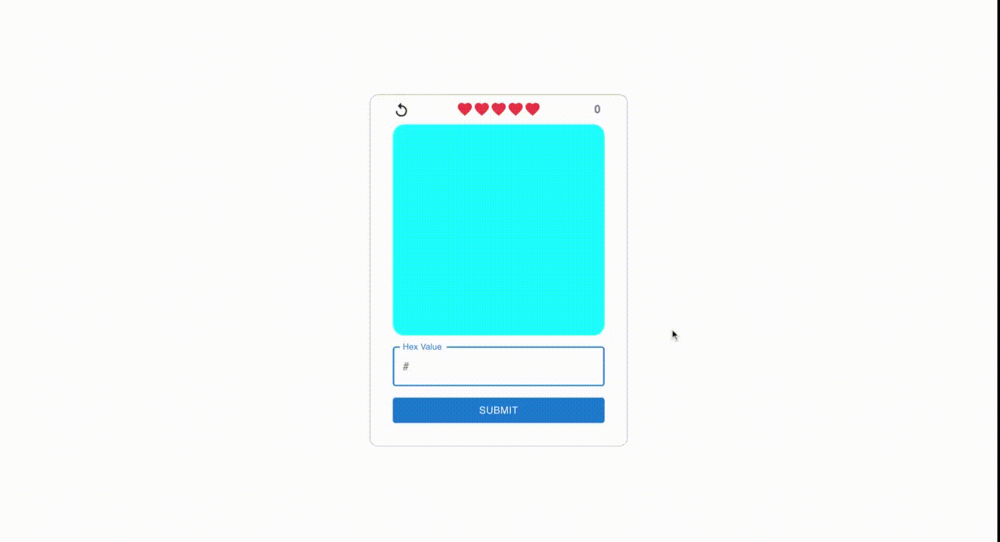

# Hex Generator

This is what I made while playing around with [MUI](https://mui.com/) and [Tailwind](https://tailwindui.com/).

## Setup

1. If you don’t have Node.js installed, [install it from here](https://nodejs.org/en/)

2. Clone this repository

3. Navigate into the project directory

   ```bash
   $ cd email-generator
   ```

4. Install the requirements

   ```bash
   $ npm install
   ```

5. Build the app

   ```bash
   $ npm run build
   ```

6. Run the app

   ```bash
   $ serve -s build
   ```

You should now be able to access the app at [http://localhost:3000](http://localhost:3000)!